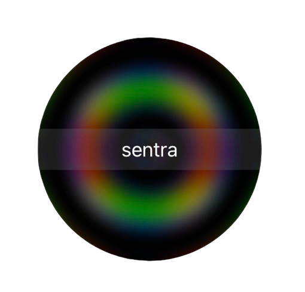

  

# Sentra

Sentra is a work-in-progress cross-platform desktop application designed to empower you to embrace mono-tasking. In a world overflowing with distractions, Sentra provides a minimalistic approach to keeping you centered.

## Key Features
* [x] **Minimalist Timer:** A clean, distraction-free timer to set focused work sessions.
* [x] **Always on top:** Draggable, small windows that stays always on top. 
* [ ] **Distraction Awareness**: {Brainstorming this one}

## Built for Efficiency 

Built with Tauri, Vite and Three.js Shaders

## Getting Started

## Usage

1. Just type your task

## Contributing

Go for it!

## License

Sentra is distributed under the [MIT License](./LICENSE.txt). 

